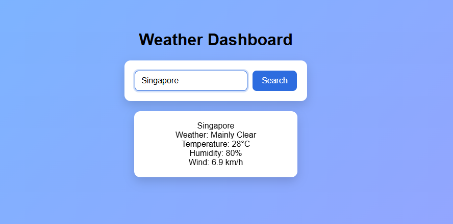

# Weather Dashboard

## Description

A responsive web application that allows users to search for any city and instantly view its current weather conditions. Built using HTML, CSS, and JavaScript, it provides real-time weather updates with a clean and intuitive user interface.

## Features

- **City Search:** Easily look up real-time weather details for any city globally.
- **Detailed Weather Metrics:** Displays temperature, humidity, wind speed, and current weather conditions.
- **Keyboard Shortcut:** Supports pressing the Enter key to trigger a quick search.
- **User Feedback:** Includes visual loading indicators and clear error messages for invalid entries.
- **Responsive Design:** Optimized layout for seamless viewing across desktop, tablet, and mobile devices.

## Technologies Used

- HTML
- CSS
- JavaScript
- Open-Meteo API
- Git
- GitHub

## How It Works

1. The user inputs a city name and submits the search form.
2. The app uses the Geocoding API to fetch the corresponding latitude and longitude for the city.
3. The coordinates are then sent to the Open-Meteo Weather API to request current weather data.
4. The application receives the weather data and updates the UI to display the temperature, humidity, wind speed, and conditions.

## Screenshots

